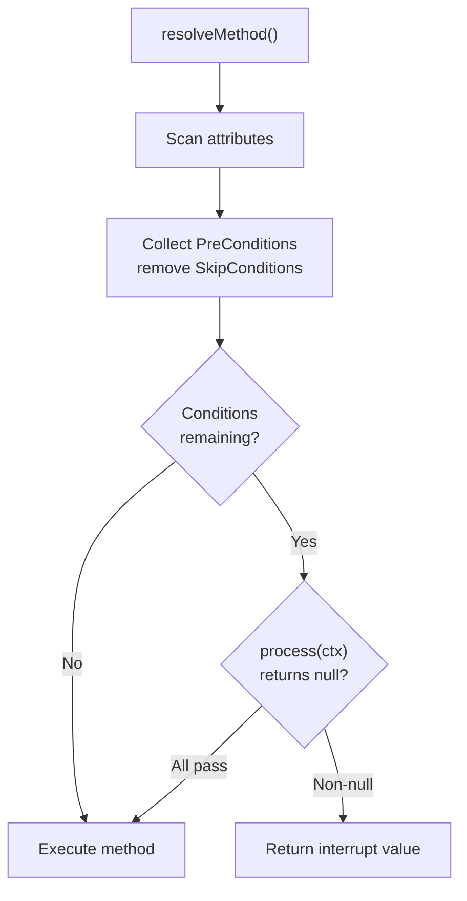
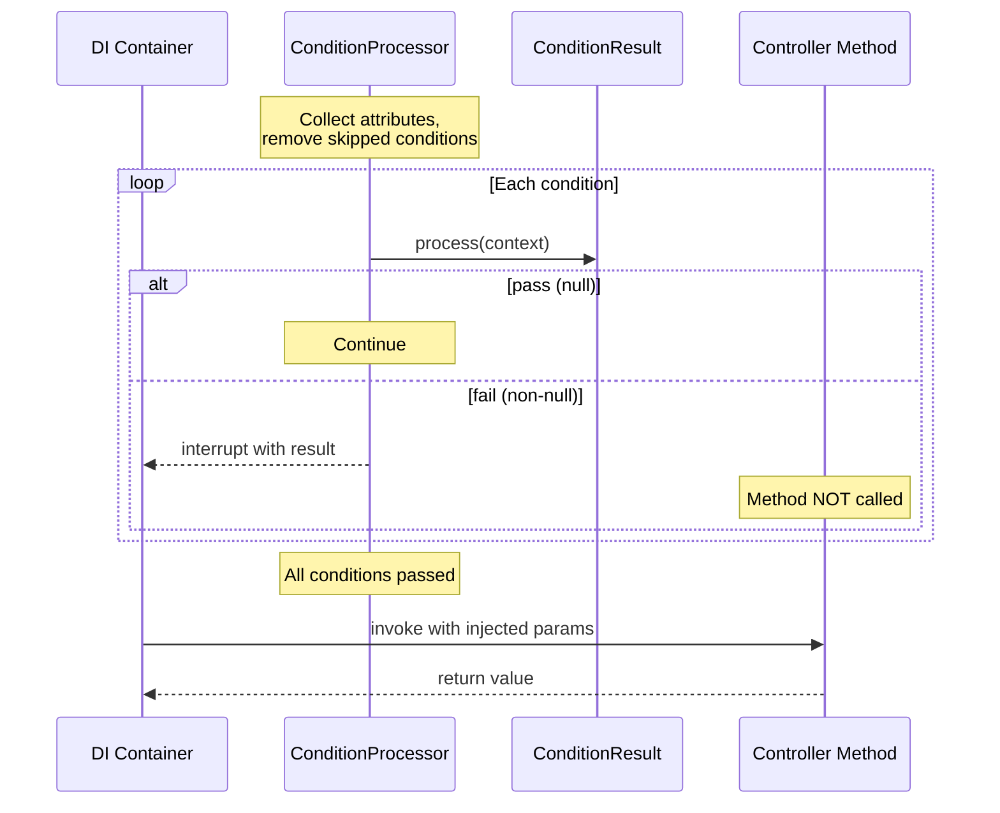

# Condition Processor

The Condition Processor provides declarative authorization and validation for controller methods using PHP 8 attributes. It integrates with the DI container's `resolveMethod()` to evaluate conditions before a method executes.

## Overview



## Attributes

### #[PreCondition]

Marks a method (or class) with a condition that must pass before execution:

```php
use Cubex\Attributes\PreCondition;

class AdminController extends Controller
{
  #[PreCondition(RequiresAuth::class)]
  #[PreCondition(RequiresRole::class, ['admin'])]
  public function getUsers(): Response
  {
    return new JsonResponse($this->listUsers());
  }
}
```

The attribute accepts:
- **`$class`** — The fully qualified class name implementing `ConditionResult`
- **`$args`** (optional) — Constructor arguments passed when instantiating the condition

### #[SkipCondition]

Exempts a method from a specific `PreCondition`. This is useful when a class-level condition should not apply to certain methods:

```php
#[PreCondition(RequiresAuth::class)]
class DashboardController extends Controller
{
  public function getIndex(): Response
  {
    // RequiresAuth IS evaluated
    return new TextResponse('Dashboard');
  }

  #[SkipCondition(RequiresAuth::class)]
  public function getHealthCheck(): Response
  {
    // RequiresAuth is SKIPPED
    return new TextResponse('OK');
  }
}
```

Both attributes are repeatable (`IS_REPEATABLE`) and can target any element (`TARGET_ALL`).

## Implementing ConditionResult

Create a condition by implementing the `ConditionResult` interface:

```php
use Cubex\Attributes\ConditionResult;
use Packaged\Context\Context;

class RequiresAuth implements ConditionResult
{
  public function process(Context $ctx): mixed
  {
    if ($ctx->request()->headers->has('Authorization'))
    {
      return null; // Allow execution to proceed
    }

    // Interrupt — this value becomes the method's return
    return new Response('Unauthorized', 401);
  }
}
```

The `process()` method:
- Returns **`null`** to allow execution to continue
- Returns **any non-null value** to interrupt execution — the returned value replaces the method's normal return value

### Conditions with Arguments

Pass constructor arguments via the attribute:

```php
class RequiresRole implements ConditionResult
{
  public function __construct(private string $role)
  {
  }

  public function process(Context $ctx): mixed
  {
    $user = $ctx->meta()->get('user');
    if ($user && $user->hasRole($this->role))
    {
      return null;
    }
    return new Response('Forbidden', 403);
  }
}
```

```php
#[PreCondition(RequiresRole::class, ['admin'])]
public function getAdminPanel(): Response
{
  // Only accessible to users with the 'admin' role
}
```

## How It Works Internally

The `ConditionProcessor` class integrates with `packaged/di-container`'s reflection system:

1. **`ConditionProcessor`** extends `AttributeWatcher` and implements `ReflectionInterrupt`
2. When `resolveMethod()` is called on a controller method, the DI container's reflection observers are notified
3. `ConditionProcessor` scans the method (and class) for `#[PreCondition]` and `#[SkipCondition]` attributes
4. Skip conditions are collected first — any `PreCondition` whose class appears in the skip list is removed
5. Each remaining condition is instantiated (via DI if available, for constructor injection) and `process($context)` is called
6. If any condition returns non-null, `shouldInterruptMethod()` returns `true` and the interrupt value is used as the method's return value

```php
// This happens automatically inside Controller::_prepareHandler()
// when Cubex DI is available:

$conditionProcessor = new ConditionProcessor($cubex);
$result = $di->resolveMethod($controller, $methodName, [], [$conditionProcessor]);
```

## Execution Flow



## Multiple Conditions

When multiple `#[PreCondition]` attributes are present, they are evaluated in order. The first condition to return a non-null value stops evaluation:

```php
#[PreCondition(RequiresAuth::class)]       // Checked first
#[PreCondition(RequiresRole::class, ['editor'])]  // Checked second
#[PreCondition(RateLimiter::class)]        // Checked third
public function postArticle(): Response
{
  // All three conditions must pass (return null)
}
```

## Class-Level vs Method-Level

Attributes on the class apply to all methods. Method-level attributes are additive. Use `#[SkipCondition]` to exempt specific methods:

```php
#[PreCondition(RequiresAuth::class)]
class SecureController extends Controller
{
  // RequiresAuth applies to all methods

  #[PreCondition(RequiresRole::class, ['admin'])]
  public function getAdmin(): Response
  {
    // Both RequiresAuth AND RequiresRole apply
  }

  #[SkipCondition(RequiresAuth::class)]
  public function getPublic(): Response
  {
    // RequiresAuth is skipped, no conditions apply
  }
}
```
