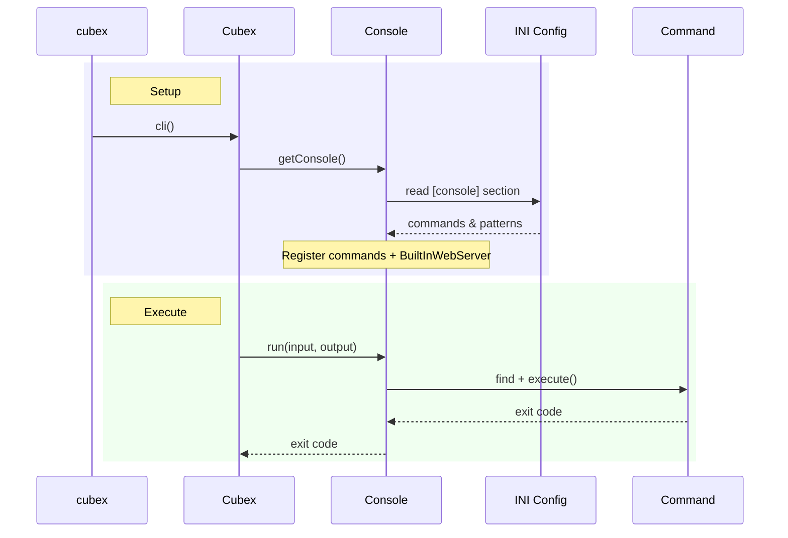

# Console

Cubex integrates with Symfony Console to provide CLI command support. It adds auto-configuration from INI files, DocBlock-driven argument/option definition, and DI integration.

## CLI Entry Point

```php
<?php
// cubex
$loader = require_once('vendor/autoload.php');
exit((new \Cubex\Cubex(__DIR__, $loader))->cli());
```



## Configuration

Commands are configured via INI files in your `conf/` directory under the `[console]` section:

```ini
; conf/defaults.ini
[console]
commands[migrate] = "App\Commands\MigrateCommand"
commands[seed] = "App\Commands\SeedCommand"

patterns[] = "App\Commands\%s"
patterns[] = "App\Console\%s"
```

### Commands

The `commands` map registers named commands. Keys are command names, values are fully qualified class names:

```ini
commands[db:migrate] = "App\Commands\Database\MigrateCommand"
commands[cache:clear] = "App\Commands\Cache\ClearCommand"
```

### Patterns

Patterns enable auto-discovery of commands by name. When a command is not found by its registered name, the console tries each pattern with the class name derived from the command name.

For example, with pattern `App\Commands\%s`, running `my.command` will try to resolve `App\Commands\My\Command`.

## ConsoleCommand

`ConsoleCommand` extends Symfony's `Command` with automatic argument/option configuration from method signatures and DocBlock annotations.

### Defining Commands

Create a command by extending `ConsoleCommand` and implementing one of three method signatures:

```php
use Cubex\Console\ConsoleCommand;

/**
 * @name greet
 * @description Greet a user by name
 */
class GreetCommand extends ConsoleCommand
{
  /**
   * Short description for --uppercase option
   * @short u
   * @flag
   */
  public bool $uppercase = false;

  public function executeCommand(
    InputInterface $input,
    OutputInterface $output,
    string $name,
    string $greeting = 'Hello'
  ): int
  {
    $message = "{$greeting}, {$name}!";

    if ($this->uppercase)
    {
      $message = strtoupper($message);
    }

    $output->writeln($message);
    return 0;
  }
}
```

```bash
php cubex greet Alice
# Hello, Alice!

php cubex greet Alice --uppercase -greeting "Good morning"
# GOOD MORNING, ALICE!
```

### Method Signatures

`ConsoleCommand` dispatches to the first available method:

| Method | Signature | Notes |
|--------|-----------|-------|
| `executeCommand` | `(InputInterface, OutputInterface, ...args)` | Full access to I/O; extra params become arguments |
| `process` | `(...args)` | Simplified; params become arguments |
| `_execute` | `(InputInterface, OutputInterface)` | Fallback; manually read input |

Parameters after the first two in `executeCommand` (or all parameters in `process`) are automatically registered as console arguments.

### Auto-Configured Arguments

Method parameters are converted to console arguments:

```php
public function process(string $name, int $count = 1): int
{
  // $name  → required argument
  // $count → optional argument (default: 1)
  return 0;
}
```

### Auto-Configured Options from Properties

Public properties are converted to console options. DocBlock annotations control behavior:

| Annotation | Effect | Example |
|------------|--------|---------|
| `@short` | Single-letter shortcut | `@short v` → `-v` |
| `@description` | Option description in help | `@description Enable verbose` |
| `@flag` | Boolean flag (no value) | `@flag` → `--verbose` |
| `@valuerequired` | Value is required | `@valuerequired` |

```php
/**
 * The output format
 * @short f
 * @valuerequired
 */
public string $format = 'json';

/**
 * Run in dry-run mode
 * @short n
 * @flag
 */
public bool $dryRun = false;
```

### DocBlock Command Metadata

Use DocBlock annotations on the class to set the command name and description:

```php
/**
 * @name cache:clear
 * @description Clear the application cache
 */
class ClearCacheCommand extends ConsoleCommand
{
  // ...
}
```

If `@name` is not specified, the command name defaults to the lowercase class basename.

### Context and DI Access

`ConsoleCommand` implements both `ContextAware` and `CubexAware`, so you have full access to the framework:

```php
class MigrateCommand extends ConsoleCommand
{
  public function process(): int
  {
    $db = $this->getCubex()->retrieve(DbConnection::class);
    $config = $this->getContext()->config();
    // ...
    return 0;
  }
}
```

## Built-In Web Server

Cubex includes a `serve` command that starts PHP's built-in web server:

```bash
php cubex serve
# Starts server at 127.0.0.1:8888

php cubex serve -p 3000
# Custom port

php cubex serve --host 0.0.0.0
# Bind to all interfaces

php cubex serve -d
# Enable xdebug

php cubex serve --useNextAvailablePort
# Auto-increment port if 8888 is in use
```

### serve Options

| Option | Short | Description |
|--------|-------|-------------|
| `--host` | | Server hostname (default: `127.0.0.1`) |
| `--port` | `-p` | Server port (default: `8888`) |
| `--router` | | PHP router script (default: `public/index.php`) |
| `--workers` | `-w` | Number of PHP CLI server workers (default: `5`) |
| `--debug` | `-d` | Enable xdebug |
| `--debugIdeKey` | `-idekey` | IDE key for xdebug (default: `PHPSTORM`) |
| `--showCommand` | | Display the raw command being executed |
| `--showfig` | | Show ASCII figlet banner (default: `true`) |
| `--useNextAvailablePort` | | Auto-find next available port |
| `--cubexLocalSubDomain` | `-c` | Use `{value}.cubex-local.com` as host |
| `--comment` | | Extra output text |

### Server Configuration via INI

Host and port can also be configured in INI files:

```ini
; conf/defaults.ini
[serve]
host = "0.0.0.0"
port = 9000
```

## Registering Commands Programmatically

Use the `ConsoleCreateEvent` to add commands at runtime:

```php
use Cubex\Console\Events\ConsoleCreateEvent;

$cubex->listen(ConsoleCreateEvent::class, function (ConsoleCreateEvent $e) {
  $e->getConsole()->add(new CustomCommand());
});
```
