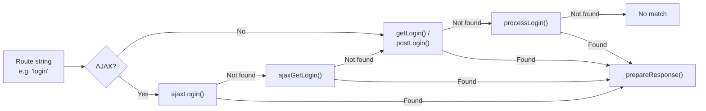

# Controllers

Controllers extend `RouteProcessor` and add HTTP verb-based method resolution, automatic response preparation, and integration with the DI container.

## Controller Method Resolution

When a route returns a string (e.g., `"login"`), the `Controller` resolves it to a method on the controller class by trying HTTP verb-prefixed method names:



The resolution order (from `_getRouteMethods()`) for a route string `"login"` is:

| Priority | XHR Request | Regular GET | Regular POST |
|----------|-------------|-------------|--------------|
| 1 | `ajaxLogin()` | `getLogin()` | `postLogin()` |
| 2 | `ajaxGetLogin()` | `processLogin()` | `processLogin()` |
| 3 | `getLogin()` / `postLogin()` | | |
| 4 | `processLogin()` | | |

The `process` prefix acts as a catch-all that matches any HTTP verb.

## Basic Controller

```php
use Cubex\Controller\Controller;
use Packaged\Http\Response\TextResponse;

class UserController extends Controller
{
  protected function _generateRoutes(): Generator
  {
    yield self::_route('/profile', 'profile');
    yield self::_route('/settings', 'settings');
    return 'index';
  }

  public function getIndex(): TextResponse
  {
    return new TextResponse('User index');
  }

  public function getProfile(): TextResponse
  {
    $userId = $this->routeData()->get('id');
    return new TextResponse("Profile for {$userId}");
  }

  public function getSettings(): string
  {
    return 'Settings page';
  }

  public function postSettings(): TextResponse
  {
    // Handle settings form submission
    return new TextResponse('Settings saved');
  }
}
```

## Response Preparation

`Controller::_prepareResponse()` automatically converts return values into `Response` objects:

| Return Type | Conversion |
|-------------|------------|
| `Response` | Returned as-is |
| `ViewModel` | Creates a `View` via `createView()`, renders it |
| `Renderable` | Calls `render()` to get string content |
| `ISafeHtmlProducer` | Produces safe HTML content |
| `string` / stringable | Wrapped in a `CubexResponse` |
| `null` | Falls back to output buffer content |

If the return value is `ContextAware` or `CubexAware`, the context and Cubex instance are set on it before processing.

## Convenience Methods

Controllers provide shortcuts for common context operations:

```php
// Access the current request
$request = $this->request();

// Access route data (captured path variables)
$id = $this->routeData()->get('id');
```

## DI-Aware Method Resolution

When a `Cubex` instance is available, controller methods are resolved through the DI container using `resolveMethod()`. This enables:

- **Constructor injection** of method parameters
- **Attribute-based conditions** via `ConditionProcessor` (see [Condition Processor]())

```php
class ApiController extends Controller
{
  #[PreCondition(RequiresAuth::class)]
  public function getSecure(UserService $users): Response
  {
    // $users is resolved via DI
    // RequiresAuth condition is checked first
    return new TextResponse('Secure content');
  }
}
```

## SingleRouteController

For controllers that handle a single endpoint with verb-based dispatch only (no sub-routes):

```php
use Cubex\Controller\SingleRouteController;

class HealthCheckController extends SingleRouteController
{
  public function get(): TextResponse
  {
    return new TextResponse('OK');
  }

  public function post(): TextResponse
  {
    return new TextResponse('Received');
  }
}
```

`SingleRouteController` returns an empty string from `_generateRoutes()`, which the controller resolves to `get()`, `post()`, `ajax()`, or `process()` depending on the HTTP verb.

## AuthedController (Deprecated)

{: .warning }
`AuthedController` is deprecated. Use [Middleware]() or [Condition Processor]() attributes instead.

`AuthedController` calls `canProcess()` before routing. If it returns `false`, the request is rejected with a 403 response:

```php
use Cubex\Controller\AuthedController;

class AdminController extends AuthedController
{
  public function canProcess(&$response): bool
  {
    return $this->getContext()->request()->has('admin_token');
  }

  public function getIndex(): string
  {
    return 'Admin panel';
  }
}
```
