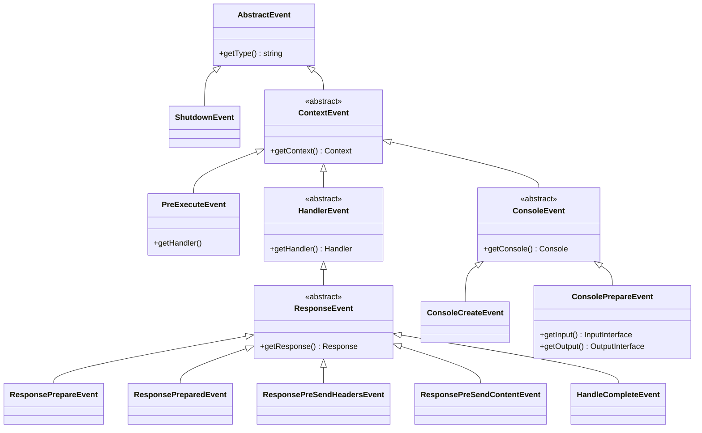
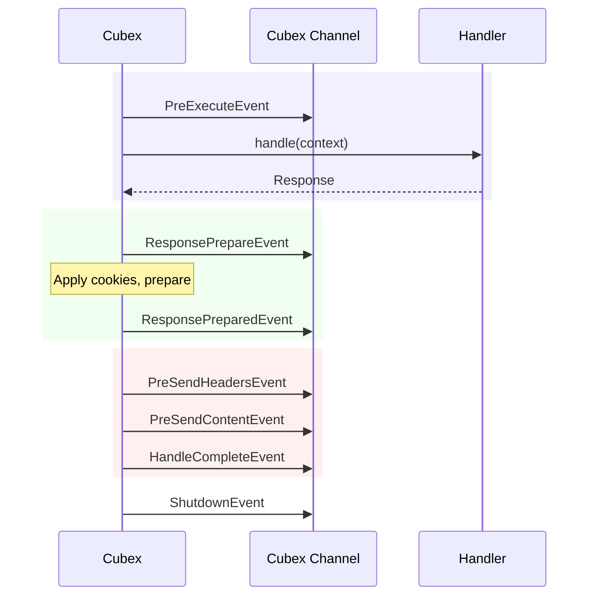

# Events

Cubex uses an event system based on `Channel` from `packaged/event`. Events are fired at key points in the HTTP and CLI lifecycles, allowing you to hook into framework behavior without modifying core code.

## Event Channels

There are two event channels:

| Channel | Accessed Via | Purpose |
|---------|-------------|---------|
| Cubex channel | `$cubex->listen()` | Framework-level lifecycle events |
| Context channel | `$context->events()` | Context-specific events |

## Listening for Events

### On the Cubex Channel

```php
use Cubex\Events\Handle\ResponsePrepareEvent;

$cubex->listen(ResponsePrepareEvent::class, function (ResponsePrepareEvent $event) {
  $response = $event->getResponse();
  $response->headers->set('X-Powered-By', 'Cubex');
});
```

### On the Context Channel

```php
use Cubex\Context\Events\ConsoleLaunchedEvent;

$context->events()->listen(
  ConsoleLaunchedEvent::class,
  function (ConsoleLaunchedEvent $event) {
    // Console is starting up
  }
);
```

## Event Hierarchy



## HTTP Lifecycle Events

These events fire on the **Cubex channel** during `Cubex::handle()`:

| Event | When It Fires | Available Data |
|-------|--------------|----------------|
| `PreExecuteEvent` | Before the handler's `handle()` is called | Context, Handler |
| `ResponsePrepareEvent` | After handler returns, before cookies/prepare | Context, Handler, Response |
| `ResponsePreparedEvent` | After `$response->prepare()` is called | Context, Handler, Response |
| `ResponsePreSendHeadersEvent` | Before `$response->sendHeaders()` | Context, Handler, Response |
| `ResponsePreSendContentEvent` | Before `$response->sendContent()` | Context, Handler, Response |
| `HandleCompleteEvent` | After the full response has been sent | Context, Handler, Response |
| `ShutdownEvent` | During `$cubex->shutdown()` | — |

### Event Flow



{: .note }
`PreExecuteEvent` is also fired by `RouteProcessor::_processHandler()` when a sub-handler is executed during route resolution.

## CLI Lifecycle Events

CLI events fire on both channels:

| Event | Channel | When It Fires | Available Data |
|-------|---------|--------------|----------------|
| `ConsoleLaunchedEvent` | Context | At the start of `Cubex::cli()` | Input, Output |
| `ConsoleCreatedEvent` | Context | When the Console object is first created | Console |
| `ConsoleCreateEvent` | Cubex | Same time as `ConsoleCreatedEvent` | Context, Console |
| `ConsolePrepareEvent` | Cubex | Just before `console->run()` | Context, Console, Input, Output |

## Event Data Access

All context events provide access to the context:

```php
$cubex->listen(PreExecuteEvent::class, function (PreExecuteEvent $e) {
  $context = $e->getContext();
  $handler = $e->getHandler();
});
```

Response events add access to the handler and response:

```php
$cubex->listen(ResponsePrepareEvent::class, function (ResponsePrepareEvent $e) {
  $context  = $e->getContext();
  $handler  = $e->getHandler();
  $response = $e->getResponse();
});
```

Console events provide access to the console application:

```php
$cubex->listen(ConsolePrepareEvent::class, function (ConsolePrepareEvent $e) {
  $console = $e->getConsole();
  $input   = $e->getInput();
  $output  = $e->getOutput();
});
```

## Common Use Cases

### Adding Response Headers

```php
$cubex->listen(ResponsePreparedEvent::class, function (ResponsePreparedEvent $e) {
  $e->getResponse()->headers->set('X-Request-Id', uniqid());
});
```

### Logging Request Duration

```php
$cubex->listen(PreExecuteEvent::class, function (PreExecuteEvent $e) {
  $e->getContext()->meta()->set('request_start', microtime(true));
});

$cubex->listen(HandleCompleteEvent::class, function (HandleCompleteEvent $e) {
  $start = $e->getContext()->meta()->get('request_start');
  $duration = microtime(true) - $start;
  Cubex::log()->info('Request completed', ['duration_ms' => $duration * 1000]);
});
```

### Registering Console Commands Dynamically

```php
$cubex->listen(ConsoleCreateEvent::class, function (ConsoleCreateEvent $e) {
  $e->getConsole()->add(new MigrateCommand());
  $e->getConsole()->add(new SeedCommand());
});
```

## Server Timing

The `Cubex\Context\Context` class automatically adds `Server-Timing` headers to responses via a listener on `ResponsePreSendHeadersEvent`. Use the context's timer API:

```php
$timer = $context->newTimer('db-query', 'Database query');
// ... perform query ...
$timer->stop();

// The Server-Timing header is added automatically before headers are sent
```
