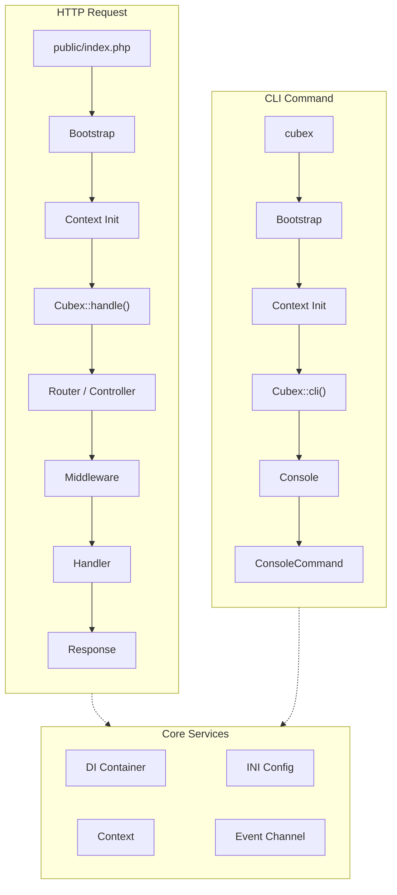

# Cubex Framework

Cubex is a PHP 8.2+ web application framework that provides routing, dependency injection, middleware, console commands, and a ViewModel layer. It is built on top of `packaged/*` libraries and Symfony components.

## Requirements

- PHP 8.2 or later
- Composer

## Installation

```bash
composer require cubex/framework
```

## Quick Start

Create a basic HTTP application with a router:

```php
<?php
// public/index.php

use Cubex\Cubex;
use Cubex\Routing\Router;
use Packaged\Http\Response\TextResponse;
use Packaged\Routing\Handler\FuncHandler;

$loader = require __DIR__ . '/../vendor/autoload.php';
$cubex = new Cubex(__DIR__ . '/..', $loader);

$router = Router::i()
  ->onPath('/', new FuncHandler(fn() => new TextResponse('Hello, Cubex!')))
  ->onPath('/about', new FuncHandler(fn() => new TextResponse('About page')));

$response = $cubex->handle($router);
$cubex->shutdown();
```

## Configuration

Cubex loads INI configuration files from a `conf/` directory relative to your project root. Files are loaded in cascade order:

1. `conf/defaults.ini`
2. `conf/defaults/config.ini`
3. `conf/{environment}.ini`
4. `conf/{environment}/config.ini`

The environment is set via the `CUBEX_ENV` environment variable.

## Core Concepts

| Topic | Description |
|-------|-------------|
| [Request Lifecycle]() | How HTTP requests and CLI commands flow through the framework |
| [Routing]() | Generator-based route matching with the Router fluent API |
| [Controllers]() | HTTP verb method resolution and response preparation |
| [Dependency Injection]() | The DI container, sharing, factories, and auto-resolution |
| [Middleware]() | Onion-layer middleware chain for request/response processing |
| [ViewModels]() | ViewModel/View separation, templating, and JSON rendering |
| [Events]() | Framework lifecycle events and the Channel dispatcher |
| [Console]() | Symfony Console integration with auto-configured commands |
| [Condition Processor]() | PHP 8 attribute-based pre-conditions and skip-conditions |

## Architecture Overview


