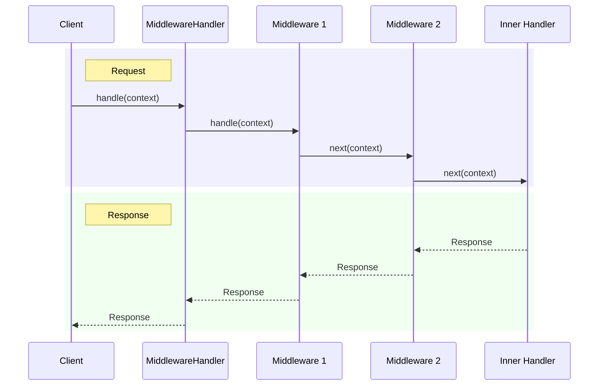

# Middleware

Cubex provides an onion-layer middleware system that wraps handlers. Each middleware can process the request before and after the inner handler executes.

## Middleware Chain



Middleware executes in an onion pattern:
1. The outermost middleware receives the request first
2. Each middleware can run logic before calling `next()` to pass to the next layer
3. The innermost layer is the actual handler
4. Responses bubble back through each middleware in reverse order

## Implementing Middleware

Extend the abstract `Middleware` base class:

```php
use Cubex\Middleware\Middleware;
use Packaged\Context\Context;
use Symfony\Component\HttpFoundation\Response;

class TimingMiddleware extends Middleware
{
  public function handle(Context $c): Response
  {
    $start = microtime(true);

    // Call the next handler in the chain
    $response = $this->next($c);

    $duration = microtime(true) - $start;
    $response->headers->set('X-Response-Time', round($duration * 1000) . 'ms');

    return $response;
  }
}
```

The key parts:
- Extend `Middleware` (or implement `MiddlewareInterface` directly)
- Call `$this->next($c)` to pass control to the next middleware or the inner handler
- You can modify the request (context) before calling `next()` and modify the response after

## MiddlewareInterface

For full control, implement the interface directly:

```php
use Cubex\Middleware\MiddlewareInterface;
use Packaged\Context\Context;
use Packaged\Routing\Handler\Handler;
use Symfony\Component\HttpFoundation\Response;

class AuthMiddleware implements MiddlewareInterface
{
  private Handler $_next;

  public function setNext(Handler $handler): Handler
  {
    $this->_next = $handler;
    return $this;
  }

  public function handle(Context $c): Response
  {
    if (!$c->request()->headers->has('Authorization'))
    {
      return new Response('Unauthorized', 401);
    }

    return $this->_next->handle($c);
  }
}
```

## Using MiddlewareHandler

`MiddlewareHandler` wraps a handler with a chain of middleware:

```php
use Cubex\Middleware\MiddlewareHandler;

$handler = new MiddlewareHandler($router);
$handler->append(new TimingMiddleware());
$handler->append(new AuthMiddleware());
$handler->append(new CorsMiddleware());

$response = $cubex->handle($handler);
```

### MiddlewareHandler Methods

| Method | Description |
|--------|-------------|
| `__construct(Handler $handler)` | Create a middleware handler wrapping an inner handler |
| `append(MiddlewareInterface $mw)` | Add middleware to the end of the chain (outermost) |
| `prepend(MiddlewareInterface $mw)` | Add middleware to the front of the chain (innermost) |
| `add(MiddlewareInterface $mw, ?int $mode)` | Add with explicit mode (`PREPEND` or `APPEND`) |
| `remove(MiddlewareInterface\|string $mw)` | Remove the first middleware matching the instance or class name |
| `replace(MiddlewareInterface\|string $old, MiddlewareInterface $new)` | Replace the first matching middleware |

### Execution Order

Middleware added with `append()` wraps further out, while `prepend()` wraps closer to the inner handler:

```php
$handler = new MiddlewareHandler($router);
$handler->append(new A());  // Outermost
$handler->append(new B());  // Even more outer
$handler->prepend(new C()); // Innermost (closest to router)

// Execution order: B → A → C → Router → C → A → B
```

## Common Middleware Patterns

### Short-Circuit Middleware

Return a response directly without calling `next()` to stop the chain:

```php
class MaintenanceMiddleware extends Middleware
{
  public function handle(Context $c): Response
  {
    if ($this->isMaintenanceMode())
    {
      return new Response('Service unavailable', 503);
    }

    return $this->next($c);
  }
}
```

### Request Modification

Modify the context before passing it along:

```php
class JsonBodyMiddleware extends Middleware
{
  public function handle(Context $c): Response
  {
    $request = $c->request();
    if ($request->getContentTypeFormat() === 'json')
    {
      $data = json_decode($request->getContent(), true);
      $request->request->replace($data ?? []);
    }

    return $this->next($c);
  }
}
```

### Response Modification

Transform the response on the way back:

```php
class CompressionMiddleware extends Middleware
{
  public function handle(Context $c): Response
  {
    $response = $this->next($c);

    if (str_contains($c->request()->headers->get('Accept-Encoding', ''), 'gzip'))
    {
      $compressed = gzencode($response->getContent());
      $response->setContent($compressed);
      $response->headers->set('Content-Encoding', 'gzip');
    }

    return $response;
  }
}
```
