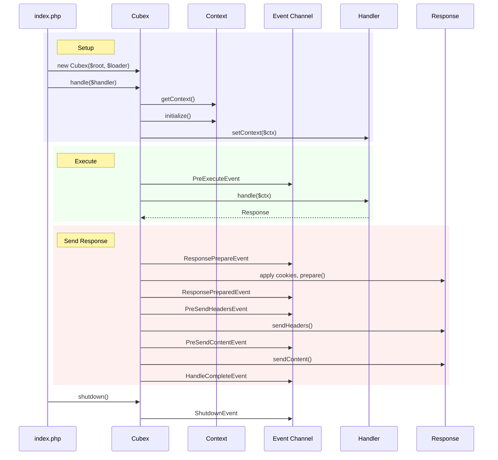
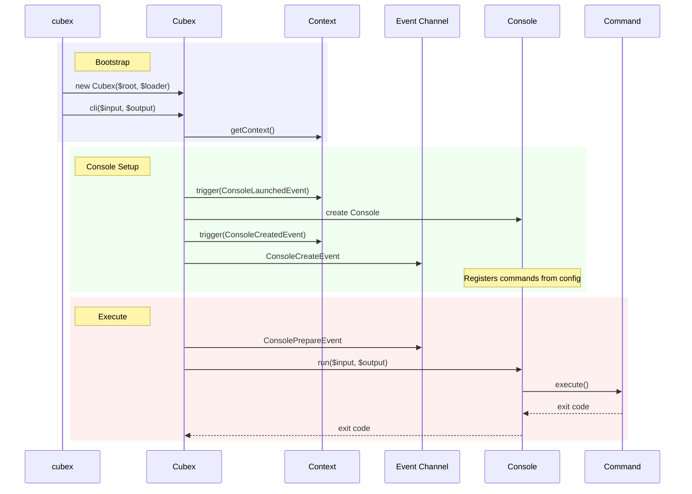

# Request Lifecycle

Cubex handles both HTTP requests and CLI commands through distinct but related lifecycles. Both begin with bootstrapping a `Cubex` instance and creating a `Context`.

## HTTP Lifecycle

The HTTP lifecycle is driven by `Cubex::handle(Handler $handler)`. Here is the full flow:



### Bootstrap

```php
$loader = require __DIR__ . '/../vendor/autoload.php';
$cubex = new Cubex(__DIR__ . '/..', $loader);
```

The constructor:
1. Sets the project root path
2. Creates an event `Channel` named `'cubex'`
3. Shares the `ClassLoader` and `DependencyInjector` (itself) in the DI container
4. Registers a `Context` factory that creates contexts from `Request::createFromGlobals()`

### Context Preparation

When `handle()` is called, it retrieves the shared `Context` from the DI container. The context is prepared with:
- **Environment** from the `CUBEX_ENV` environment variable
- **Project root** path
- **Configuration** loaded from INI files in cascade order
- **Cubex reference** set on the context (if `CubexAware`)

### Handler Execution

The handler (typically a `Router`, `Application`, or `Controller`) receives the context and produces a `Response`. If the handler is `ContextAware`, its context is set before execution.

### Response Processing

After the handler returns a response, Cubex:
1. Fires `ResponsePrepareEvent` (listeners can modify the response)
2. Applies cookies from the context's cookie jar
3. Calls `$response->prepare($request)` to finalize headers
4. Fires `ResponsePreparedEvent`
5. Sends headers, flushes, then sends content
6. Calls `fastcgi_finish_request()` if running under PHP-FPM
7. Fires `HandleCompleteEvent`

### Exception Handling

By default, Cubex catches exceptions in production environments and re-throws them in `local` and `dev` environments. This behavior is controlled by `setThrowEnvironments()`:

```php
$cubex->setThrowEnvironments([Context::ENV_LOCAL, Context::ENV_DEV]);
```

## CLI Lifecycle

The CLI lifecycle is driven by `Cubex::cli()`:



### CLI Bootstrap

```php
$loader = require __DIR__ . '/../vendor/autoload.php';
$cubex = new Cubex(__DIR__ . '/..', $loader);
exit($cubex->cli());
```

`Cubex::cli()` creates default `ArgvInput` and `ConsoleOutput` if none are provided, then:
1. Fires `ConsoleLaunchedEvent` on the context event channel
2. Creates the `Console` application (lazy, cached)
3. Fires `ConsoleCreatedEvent` (context channel) and `ConsoleCreateEvent` (cubex channel)
4. Fires `ConsolePrepareEvent` on the cubex channel
5. Runs the console application
6. Returns the exit code (capped at 255)

### Shutdown

Call `$cubex->shutdown()` after handling completes. This fires the `ShutdownEvent` exactly once (guarded against double-shutdown). If shutdown is not called explicitly, the destructor will attempt it and log a warning.
