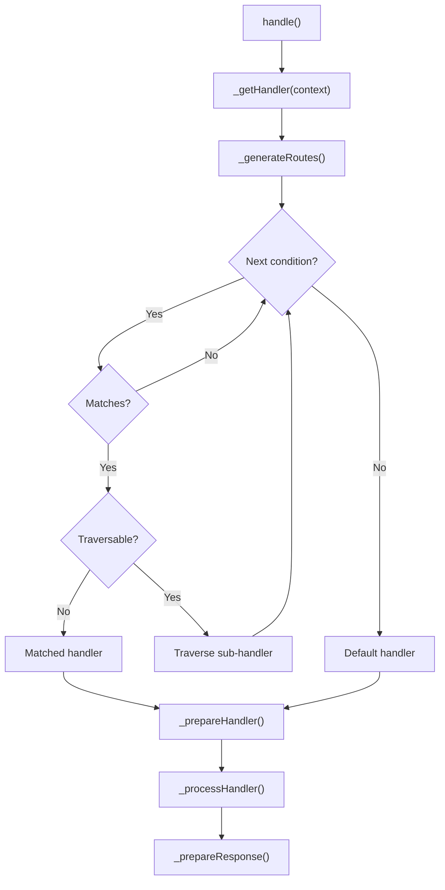

# Routing

Cubex uses a generator-based routing system built on `packaged/routing`. Routes are defined by yielding conditions from `_generateRoutes()`, and the framework traverses them to find a matching handler.

## How Route Resolution Works



The `RouteSelector` base class (from `packaged/routing`) calls `_generateRoutes()` and iterates through the yielded `ConditionHandler` pairs. For each:

1. The condition is evaluated against the current context
2. If the handler is a `Route` (traversable), it recurses into the sub-handler
3. Otherwise, the matched handler is returned

The result passes through `_prepareHandler()` (string-to-class resolution, redirect handling) and then `_processHandler()` (execution).

## The Router Class

`Router` provides a fluent API for defining routes without subclassing:

```php
use Cubex\Routing\Router;
use Packaged\Http\Response\TextResponse;
use Packaged\Routing\Handler\FuncHandler;

$router = Router::i()
  ->onPath('/hello', new FuncHandler(
    fn() => new TextResponse('Hello, World!')
  ))
  ->onPathFunc('/greet/{name}', function ($ctx) {
    $name = $ctx->routeData()->get('name');
    return new TextResponse("Hello, {$name}!");
  })
  ->setDefaultHandler(new FuncHandler(
    fn() => new TextResponse('Not Found', 404)
  ));
```

### Router Methods

| Method | Description |
|--------|-------------|
| `Router::i()` | Static factory for a new Router instance |
| `onPath($path, $handler)` | Add a route matching the given path pattern |
| `onPathFunc($path, callable $func)` | Add a route with a callable (wrapped in `FuncHandler`) |
| `setDefaultHandler(Handler $handler)` | Set the fallback handler when no route matches |
| `addCondition(ConditionHandler $cond)` | Add a custom condition/handler pair |
| `getHandler(Context $ctx)` | Resolve the matching handler for a context |

### Path Patterns

Path matching uses `RequestCondition` from `packaged/routing`. Patterns support:

| Syntax | Description | Example |
|--------|-------------|---------|
| `/literal` | Exact path segment | `/users` |
| `/{name}` | Named path variable | `/users/{id}` |
| `/{name@constraint}` | Constrained variable | `/{id@num}` |
| Prefix matching | Routes match path prefixes by default | `/api` matches `/api/users` |

Route data (captured variables) is available via `$context->routeData()`.

## Generator-Based Routes

For custom route processors, override `_generateRoutes()` to yield route conditions:

```php
use Cubex\Routing\RouteProcessor;
use Packaged\Routing\ConditionHandler;
use Packaged\Routing\Handler\FuncHandler;
use Packaged\Routing\RequestCondition;

class MyRouter extends RouteProcessor
{
  protected function _generateRoutes(): Generator
  {
    yield self::_route('/dashboard', DashboardController::class);
    yield self::_route('/api', ApiRouter::class);
    yield self::_route('/health', new FuncHandler(
      fn() => new TextResponse('OK')
    ));
    // Default handler returned (not yielded)
    return new FuncHandler(fn() => new TextResponse('Not Found', 404));
  }
}
```

The `_route()` helper (from `RouteSelector`) creates `ConditionHandler` pairs from a path and handler.

## Redirect Shorthand

String handlers beginning with `@` are treated as redirects:

```
@301!/new-url     → 301 redirect to /new-url
@302!/other       → 302 redirect to /other
```

This is handled in `RouteProcessor::_prepareHandler()`.

## Handler Resolution Chain

When `_prepareHandler()` processes a handler, it follows this chain:

1. **String containing `\`**: Treated as a class name — resolved via DI container (if Cubex is available) or instantiated directly
2. **String starting with `@`**: Parsed as a redirect (`@{code}!{url}`)
3. **Callable**: Invoked directly, result processed recursively
4. **Handler instance**: `handle()` is called with the context
5. **String (in Controller)**: Resolved to controller methods via HTTP verb prefixes (see [Controllers]())

## Nested Routing

Routes can be nested by returning other `RouteProcessor` instances (routers, applications, or controllers) as handlers:

```php
protected function _generateRoutes(): Generator
{
  // ApiRouter is itself a RouteProcessor with its own _generateRoutes()
  yield self::_route('/api', ApiRouter::class);
  yield self::_route('/admin', AdminController::class);
}
```

The path is consumed segment by segment as the route traverses into nested handlers.
