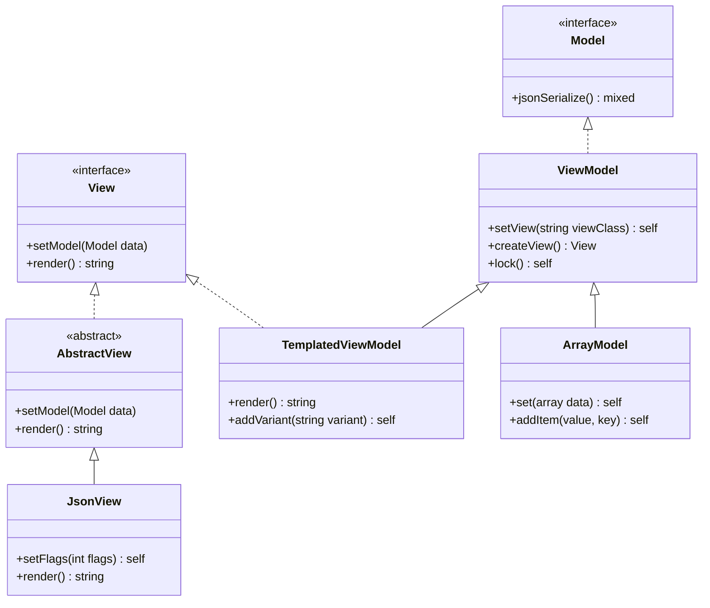
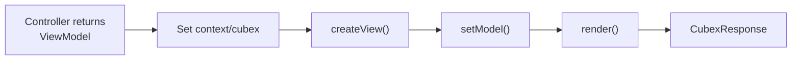

# ViewModels

Cubex separates data (Models/ViewModels) from presentation (Views). This pattern keeps business logic out of templates and makes models independently testable and JSON-serializable.

## Class Hierarchy



## ViewModel

The primary data container. Holds data as public properties, supports JSON serialization, and can create a corresponding View:

```php
use Cubex\ViewModel\ViewModel;

class UserProfileModel extends ViewModel
{
  protected string $_defaultView = UserProfileView::class;

  public string $name;
  public string $email;
  public int $age;
}
```

### Creating and Using

```php
$model = new UserProfileModel();
$model->name = 'Alice';
$model->email = 'alice@example.com';
$model->age = 30;

// Create the associated view and render
$view = $model->createView();
$html = $view->render();

// Or serialize to JSON
$json = json_encode($model);
// {"name":"Alice","email":"alice@example.com","age":30}
```

### Locking (Immutability)

Call `lock()` to freeze the model's state. After locking, property values are captured and the model becomes read-only:

```php
$model->lock();

// Properties are still readable
echo $model->name; // "Alice"

// But setting throws an exception
$model->name = 'Bob'; // Throws: "Cannot set property 'name' ... is immutable"
```

Locked models serialize from their frozen snapshot rather than live properties.

### Custom View Override

Override the view class at creation time:

```php
$view = $model->createView(MobileUserProfileView::class);
```

## View

Views receive a model and render it to a string. Implement the `View` interface:

```php
use Cubex\ViewModel\View;
use Cubex\ViewModel\Model;

class UserProfileView implements View
{
  private Model $_model;

  public function setModel(Model $data): void
  {
    $this->_model = $data;
  }

  public function render(): string
  {
    return "<div class='profile'>"
      . "<h1>{$this->_model->name}</h1>"
      . "<p>{$this->_model->email}</p>"
      . "</div>";
  }
}
```

### AbstractView

A convenient base class that stores the model and provides a `_render()` hook:

```php
use Cubex\ViewModel\AbstractView;

class UserCardView extends AbstractView
{
  protected function _render(): ?ISafeHtmlProducer
  {
    // Access the model via $this->_model
    return new SafeHtml("<div>{$this->_model->name}</div>");
  }
}
```

## TemplatedViewModel

Combines ViewModel and View into a single class. Renders using `.phtml` template files located alongside the class file:

```php
use Cubex\ViewModel\TemplatedViewModel;

class DashboardPage extends TemplatedViewModel
{
  public int $userCount;
  public int $orderCount;
  public array $recentOrders;
}
```

With a template at `DashboardPage.phtml` in the same directory:

```php
<!-- DashboardPage.phtml -->
<div class="dashboard">
  <h1>Dashboard</h1>
  <p>Users: <?= $this->userCount ?></p>
  <p>Orders: <?= $this->orderCount ?></p>
  <ul>
    <?php foreach($this->recentOrders as $order): ?>
      <li><?= $order['id'] ?>: <?= $order['total'] ?></li>
    <?php endforeach; ?>
  </ul>
</div>
```

### Template Variants

Add variant templates that take priority over the default. Useful for device-specific or A/B test rendering:

```php
$page = new DashboardPage();
$page->addVariant('mobile');
// Looks for DashboardPage.mobile.phtml first,
// falls back to DashboardPage.phtml
echo $page->render();
```

### Self-Rendering

`TemplatedViewModel` acts as its own view. Calling `createView()` without an override returns `$this`:

```php
$page = new DashboardPage();
$view = $page->createView(); // Returns $page itself
echo $view->render();        // Renders the template
```

## JsonView

Renders any `Model` as JSON:

```php
use Cubex\ViewModel\JsonView;

$model = new UserProfileModel();
$model->name = 'Alice';
$model->email = 'alice@example.com';

$view = new JsonView();
$view->setModel($model);
$view->setFlags(JSON_PRETTY_PRINT | JSON_UNESCAPED_SLASHES);
echo $view->render();
```

## ArrayModel

A ViewModel backed by a simple array instead of typed properties:

```php
use Cubex\ViewModel\ArrayModel;

$model = new ArrayModel();
$model->addItem('Alice', 'name');
$model->addItem('alice@example.com', 'email');
$model->set(['tags' => ['admin', 'user']]);

echo json_encode($model);
// {"name":"Alice","email":"alice@example.com","tags":["admin","user"]}
```

## ViewModel Flow in Controllers

When a controller method returns a `ViewModel`, the framework handles view creation and rendering automatically:



```php
class ProfileController extends Controller
{
  public function getIndex(): UserProfileModel
  {
    $model = new UserProfileModel();
    $model->name = 'Alice';
    $model->email = 'alice@example.com';
    // Controller::_prepareResponse() handles the rest
    return $model;
  }
}
```
